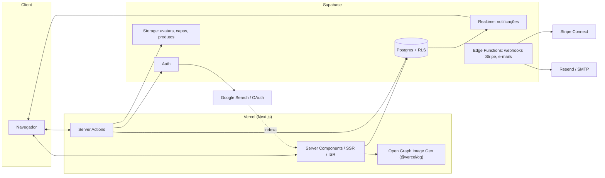

# Arquitetura

## Stack

| Camada | Tecnologia | Motivo |
|---|---|---|
| Frontend | Next.js 14+ (App Router), TypeScript | SSR/ISR para SEO de poemas, Server Components reduzem JS no cliente |
| UI | Tailwind CSS + shadcn/ui | Componentes acessíveis, fáceis de "desestilizar" da cara padrão de rede social |
| Backend | Supabase (Postgres, Auth, Storage, Realtime, Edge Functions) | Um único provedor cobre banco, auth, arquivos e RLS — reduz custo de infra para um projeto que começa pequeno |
| Deploy | Vercel | Integração nativa com Next.js, preview deploys por PR, edge network para leitura rápida global |
| Pagamentos (fase Marketplace) | Stripe Connect | Cada autor = connected account; a plataforma retém comissão automaticamente no split |
| E-mail transacional | Resend (ou Supabase + provedor SMTP) | Confirmação de conta, recuperação de senha, notificações de novo comentário |
| Busca (MVP) | Postgres full-text search (`tsvector`) | Sem custo extra de serviço externo; suficiente até a base de poemas crescer |
| Busca (V2+) | Meilisearch/Typesense (self-hosted) ou Algolia | Busca fuzzy, por sentimento, com relevância melhor quando o volume justificar |

## Diagrama de alto nível



## Padrões de acesso a dados

- **Leitura pública (poema publicado, perfil, coleção pública):** Server Components fazem a
  query diretamente no Supabase com a `publishable key`; RLS garante que só dados públicos
  retornam. (Chamada antiga: `anon key` — mesma função, nome novo no painel do Supabase.)
- **Escrita (publicar poema, curtir, comentar, seguir):** Server Actions autenticadas, usando
  a sessão do usuário (cookie do Supabase Auth) — nunca a `secret key` no cliente.
- **Operações privilegiadas (webhook do Stripe, contagem de views, moderação):** Edge Functions
  com a `secret key` (antiga `service_role key`), nunca exposta ao navegador.
- **RLS é a linha de defesa principal.** Toda tabela sensível tem policy própria (ver
  [[02-banco-de-dados]]) — a aplicação nunca deve depender só da lógica do frontend para
  impedir acesso indevido.

## Renderização e SEO

- Páginas de poema (`/@usuario/slug`) e perfil (`/@usuario`) usam **ISR** (revalidação a cada
  poucos minutos) — rápidas como estático, mas atualizam sem rebuild manual.
- `generateMetadata` por página injeta título, descrição, Open Graph e `canonical`.
- Imagem OG gerada dinamicamente por poema via `@vercel/og` (título + trecho + nome do autor
  sobre o fundo da identidade visual) — cada poema fica bonito quando compartilhado no
  WhatsApp/Instagram, o canal de aquisição inicial mais importante.
- `sitemap.ts` e `robots.ts` nativos do App Router, gerados a partir da tabela `poems`.

## Estrutura de pastas sugerida (Next.js App Router)

```
app/
  (marketing)/
    page.tsx                  # landing page
    layout.tsx
  (auth)/
    login/page.tsx
    cadastro/page.tsx
    recuperar-senha/page.tsx
  (app)/                       # área autenticada
    dashboard/
      page.tsx
      novo-poema/page.tsx
      poemas/page.tsx
      rascunhos/page.tsx
      colecoes/page.tsx
      perfil/page.tsx
      configuracoes/page.tsx
  [username]/
    page.tsx                   # perfil público /@usuario
    [slug]/page.tsx             # poema /@usuario/slug
    colecoes/[slug]/page.tsx
  descubra/
    page.tsx
    em-alta/page.tsx
    novos-autores/page.tsx
    categorias/[slug]/page.tsx
    sentimentos/[slug]/page.tsx
  busca/page.tsx
  sitemap.ts
  robots.ts
components/
  ui/                          # shadcn/ui
  poem/
  profile/
  editor/
lib/
  supabase/
    client.ts                  # client-side (browser) client
    server.ts                  # server component/action client
    admin.ts                   # secret key, uso restrito a Edge Functions/Route Handlers
  actions/                     # server actions (createPoem, toggleLike, ...)
```

## Buckets de Storage (Supabase Storage)

| Bucket | Conteúdo | Público? |
|---|---|---|
| `avatars` | Fotos de perfil | Público (leitura) |
| `banners` | Banners de perfil | Público (leitura) |
| `poem-covers` | Capas opcionais de poema | Público (leitura) |
| `products` | Imagens de produtos da loja (v2) | Público (leitura) |
| `ebooks` | Arquivos de eBook vendidos | **Privado**, URL assinada gerada só após compra confirmada |

## Considerações de escalabilidade

- Postgres do Supabase aguenta bem o volume esperado nos primeiros 1-2 anos; migrar para
  busca dedicada (Meilisearch) e cache (Redis/Vercel KV) só quando métricas justificarem.
- Contagem de `view_count` não deve ser `UPDATE` síncrono por request (contenção em poemas
  virais) — usar tabela de eventos (`poem_views`) + agregação assíncrona (cron/Edge Function)
  ou incremento via `rpc` com throttling por IP/sessão.
- Cache de páginas de poema/perfil via ISR já resolve a maior parte da carga de leitura.
