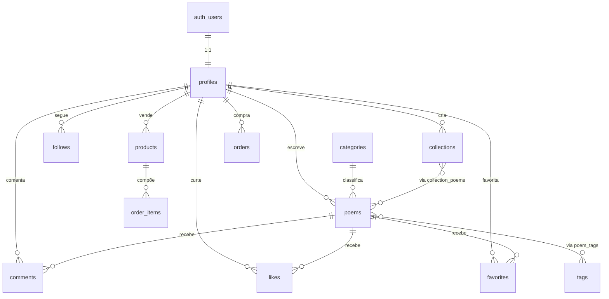

# Banco de Dados

PostgreSQL via Supabase. `auth.users` é gerenciado pelo Supabase Auth; `profiles` estende com
os dados públicos do autor/leitor.

## Diagrama de relacionamento



## Tabelas núcleo (MVP)

### `profiles`

```sql
create table public.profiles (
  id            uuid primary key references auth.users(id) on delete cascade,
  username      citext unique not null check (char_length(username) between 3 and 30),
  display_name  text not null,
  bio           text,
  avatar_url    text,
  banner_url    text,
  social_links  jsonb not null default '{}',  -- { "instagram": "...", "twitter": "..." }
  created_at    timestamptz not null default now(),
  updated_at    timestamptz not null default now()
);

-- criado automaticamente via trigger no signup (auth.users -> profiles)
create trigger on_auth_user_created
  after insert on auth.users
  for each row execute procedure public.handle_new_user();
```

### `categories`

```sql
create table public.categories (
  id          uuid primary key default gen_random_uuid(),
  name        text not null,
  slug        text unique not null,
  description text
);
-- seed: Poesia, Crônica, Haicai, Soneto, Verso livre, Microconto...
```

### `poems`

```sql
create type poem_status as enum ('draft', 'published');

create table public.poems (
  id            uuid primary key default gen_random_uuid(),
  author_id     uuid not null references public.profiles(id) on delete cascade,
  title         text not null,
  slug          text not null,
  content       text not null,              -- markdown/plain text com quebras preservadas
  excerpt       text,                        -- gerado automaticamente ou custom, p/ SEO e cards
  cover_url     text,
  category_id   uuid references public.categories(id),
  status        poem_status not null default 'draft',
  reading_time_seconds int not null default 0,  -- calculado no save (~200 palavras/min)
  view_count    bigint not null default 0,
  published_at  timestamptz,
  created_at    timestamptz not null default now(),
  updated_at    timestamptz not null default now(),
  search_vector tsvector generated always as (
    setweight(to_tsvector('portuguese', coalesce(title, '')), 'A') ||
    setweight(to_tsvector('portuguese', coalesce(content, '')), 'B')
  ) stored,
  unique (author_id, slug)
);

create index poems_search_idx on public.poems using gin (search_vector);
create index poems_published_idx on public.poems (published_at desc) where status = 'published';
create index poems_author_idx on public.poems (author_id);
```

URL pública: `/@{profiles.username}/{poems.slug}`.

### `tags` e `poem_tags`

```sql
create type tag_type as enum ('livre', 'sentimento');

create table public.tags (
  id   uuid primary key default gen_random_uuid(),
  name text not null,
  slug text unique not null,
  type tag_type not null default 'livre'
);
-- seed type='sentimento': Melancolia, Esperança, Amor, Saudade, Solidão, Natureza, Existencialismo

create table public.poem_tags (
  poem_id uuid not null references public.poems(id) on delete cascade,
  tag_id  uuid not null references public.tags(id) on delete cascade,
  primary key (poem_id, tag_id)
);
```

### `collections` e `collection_poems`

```sql
create table public.collections (
  id          uuid primary key default gen_random_uuid(),
  author_id   uuid not null references public.profiles(id) on delete cascade,
  title       text not null,
  slug        text not null,
  description text,
  cover_url   text,
  is_public   boolean not null default true,
  created_at  timestamptz not null default now(),
  unique (author_id, slug)
);

create table public.collection_poems (
  collection_id uuid not null references public.collections(id) on delete cascade,
  poem_id       uuid not null references public.poems(id) on delete cascade,
  position      int not null default 0,
  primary key (collection_id, poem_id)
);
```

### `comments`

```sql
create table public.comments (
  id                 uuid primary key default gen_random_uuid(),
  poem_id            uuid not null references public.poems(id) on delete cascade,
  author_id          uuid not null references public.profiles(id) on delete cascade,
  parent_comment_id  uuid references public.comments(id) on delete cascade,  -- respostas, V2
  content             text not null check (char_length(content) between 1 and 2000),
  is_deleted          boolean not null default false,
  created_at          timestamptz not null default now(),
  updated_at          timestamptz not null default now()
);

create index comments_poem_idx on public.comments (poem_id, created_at);
```

### `likes` / `favorites` / `follows`

```sql
create table public.likes (
  poem_id    uuid not null references public.poems(id) on delete cascade,
  user_id    uuid not null references public.profiles(id) on delete cascade,
  created_at timestamptz not null default now(),
  primary key (poem_id, user_id)
);

create table public.favorites (
  poem_id    uuid not null references public.poems(id) on delete cascade,
  user_id    uuid not null references public.profiles(id) on delete cascade,
  created_at timestamptz not null default now(),
  primary key (poem_id, user_id)
);

create table public.follows (
  follower_id  uuid not null references public.profiles(id) on delete cascade,
  following_id uuid not null references public.profiles(id) on delete cascade,
  created_at   timestamptz not null default now(),
  primary key (follower_id, following_id),
  check (follower_id <> following_id)
);
```

## Tabelas de Fase 2 (Comunidade / Estatísticas / Marketplace)

```sql
-- Eventos de visualização (agregados depois em poems.view_count via job)
create table public.poem_views (
  id         bigint generated always as identity primary key,
  poem_id    uuid not null references public.poems(id) on delete cascade,
  viewer_id  uuid references public.profiles(id),   -- null se anônimo
  session_id text,                                    -- para deduplicar anônimos
  viewed_at  timestamptz not null default now()
);

create type notification_type as enum ('like', 'comment', 'follow', 'mention', 'sale');

create table public.notifications (
  id          uuid primary key default gen_random_uuid(),
  user_id     uuid not null references public.profiles(id) on delete cascade,
  type        notification_type not null,
  actor_id    uuid references public.profiles(id),
  poem_id     uuid references public.poems(id) on delete cascade,
  comment_id  uuid references public.comments(id) on delete cascade,
  read_at     timestamptz,
  created_at  timestamptz not null default now()
);

-- Marketplace
create type product_type as enum ('ebook', 'livro_fisico', 'camiseta', 'moletom', 'caneca', 'poster', 'ecobag', 'marcador', 'outro');

create table public.products (
  id          uuid primary key default gen_random_uuid(),
  author_id   uuid not null references public.profiles(id) on delete cascade,
  title       text not null,
  description text,
  type        product_type not null,
  price_cents int not null check (price_cents >= 0),
  currency    text not null default 'BRL',
  images      jsonb not null default '[]',
  stock       int,                          -- null = ilimitado/digital
  file_path   text,                          -- caminho no bucket privado 'ebooks'
  is_active   boolean not null default true,
  created_at  timestamptz not null default now()
);

create type order_status as enum ('pending', 'paid', 'fulfilled', 'cancelled', 'refunded');

create table public.orders (
  id                        uuid primary key default gen_random_uuid(),
  buyer_id                  uuid not null references public.profiles(id),
  status                    order_status not null default 'pending',
  total_cents               int not null,
  stripe_payment_intent_id  text,
  created_at                timestamptz not null default now()
);

create table public.order_items (
  id          uuid primary key default gen_random_uuid(),
  order_id    uuid not null references public.orders(id) on delete cascade,
  product_id  uuid not null references public.products(id),
  author_id   uuid not null references public.profiles(id),   -- para split de pagamento
  quantity    int not null default 1,
  unit_price_cents int not null
);
```

## Row Level Security — padrão geral

RLS habilitado em **todas** as tabelas. Padrão:

```sql
alter table public.poems enable row level security;

create policy "poems públicos são visíveis a todos"
  on public.poems for select
  using (status = 'published' or author_id = auth.uid());

create policy "autor cria seus próprios poemas"
  on public.poems for insert
  with check (author_id = auth.uid());

create policy "autor edita/apaga seus próprios poemas"
  on public.poems for update using (author_id = auth.uid());
create policy "autor apaga seus próprios poemas"
  on public.poems for delete using (author_id = auth.uid());
```

O mesmo padrão (leitura pública do que é público + escrita restrita ao dono) se repete em
`collections` (checar `is_public`), `comments`, `likes`, `favorites`, `follows`, `products`.
`profiles` tem select público total (é o "perfil"), update restrito a `id = auth.uid()`.
`orders`/`order_items` só visíveis ao `buyer_id` ou ao `author_id` do item (autor vê suas
vendas); toda escrita de status de pagamento acontece via Edge Function com `service_role`,
nunca pelo cliente.
