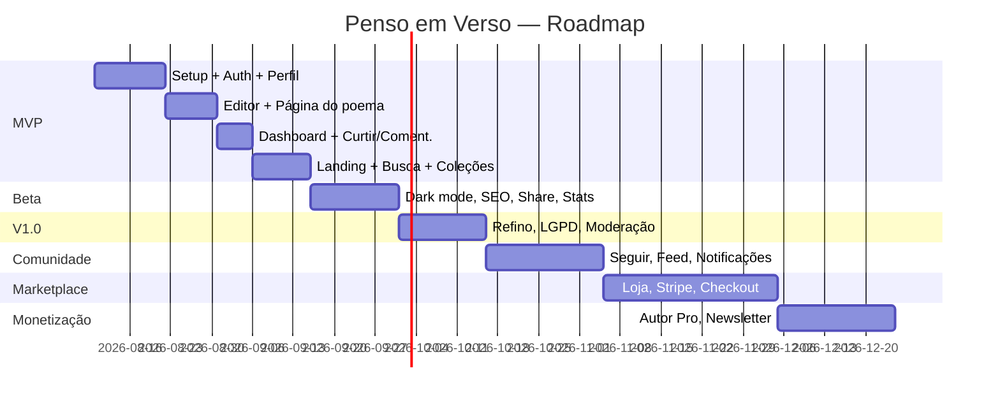

# Roadmap

Legenda — Prioridade: 🔴 Alta · 🟡 Média · 🟢 Baixa. Dificuldade: ● Baixa · ●● Média · ●●● Alta.
Estimativas assumem 1 dev full-stack full-time (ajustar proporcionalmente com mais gente).

## Fase 1 — MVP (objetivo: tirar o grupo do WhatsApp para uma plataforma própria)

| Funcionalidade | Prioridade | Dificuldade | Estimativa |
|---|---|---|---|
| Setup do projeto (Next.js + Supabase + Vercel + shadcn/ui) | 🔴 | ● | 2-3 dias |
| Auth (cadastro, login, recuperação de senha, Google OAuth) | 🔴 | ●● | 4-5 dias |
| Perfil público + edição de perfil | 🔴 | ●● | 4-5 dias |
| Editor de poema (rascunho/publicar) | 🔴 | ●● | 5-6 dias |
| Página do poema com URL `/@usuario/slug` | 🔴 | ● | 2-3 dias |
| Dashboard (meus poemas, rascunhos) | 🔴 | ● | 3 dias |
| Curtir / favoritar | 🔴 | ● | 2 dias |
| Comentários simples | 🟡 | ● | 2-3 dias |
| Landing page | 🔴 | ●● | 4-5 dias |
| Busca simples (Postgres full-text) | 🟡 | ●● | 3 dias |
| Coleções | 🟡 | ●● | 3-4 dias |
| **Total estimado** | | | **~6-7 semanas** |

**Critério de saída do MVP:** todos os membros atuais do grupo conseguem migrar seus poemas e
têm um perfil publicável.

## Fase 2 — Beta

| Funcionalidade | Prioridade | Dificuldade | Estimativa |
|---|---|---|---|
| Modo claro/escuro completo | 🔴 | ● | 2 dias |
| Compartilhamento (OG image dinâmica, botões) | 🔴 | ●● | 3 dias |
| SEO básico (metadata, sitemap, robots) | 🔴 | ● | 2-3 dias |
| Categorias e tags (incl. sentimento) | 🟡 | ● | 2 dias |
| Onboarding guiado (3 passos) | 🟡 | ● | 2-3 dias |
| Estatísticas básicas (views, curtidas) | 🟡 | ●● | 3-4 dias |
| Página "Descubra" (poemas do dia, em alta) | 🟡 | ●● | 4 dias |
| **Total estimado** | | | **~3 semanas** |

## Fase 3 — V1.0 (lançamento público)

| Funcionalidade | Prioridade | Dificuldade | Estimativa |
|---|---|---|---|
| Refino visual completo + acessibilidade | 🔴 | ●● | 1 semana |
| Performance (ISR, otimização de imagens) | 🔴 | ●● | 3-4 dias |
| Página "Novos autores" / "Mais lidos" | 🟡 | ● | 2-3 dias |
| Termos de uso, política de privacidade, LGPD | 🔴 | ● | 2-3 dias |
| Moderação básica (denunciar poema/comentário) | 🟡 | ●● | 3 dias |
| **Total estimado** | | | **~2,5-3 semanas** |

## Fase 4 — Comunidade

| Funcionalidade | Prioridade | Dificuldade | Estimativa |
|---|---|---|---|
| Seguir autores | 🔴 | ● | 2-3 dias |
| Feed de seguidos | 🔴 | ●● | 3-4 dias |
| Notificações (in-app + e-mail) | 🔴 | ●●● | 1-1,5 semana |
| Comentários aprimorados (respostas, menções) | 🟡 | ●● | 4-5 dias |
| Coleções públicas com descoberta | 🟡 | ● | 2 dias |
| Recomendações simples (mesma categoria/tags/autor) | 🟢 | ●● | 3-4 dias |
| **Total estimado** | | | **~3-4 semanas** |

## Fase 5 — Marketplace

| Funcionalidade | Prioridade | Dificuldade | Estimativa |
|---|---|---|---|
| Modelagem de produtos + loja no perfil | 🔴 | ●● | 1 semana |
| Integração Stripe Connect (onboarding de autor vendedor) | 🔴 | ●●● | 1,5-2 semanas |
| Checkout + pedidos | 🔴 | ●●● | 1,5 semanas |
| Entrega de eBook (download seguro) | 🔴 | ●● | 3-4 dias |
| Painel de vendas do autor | 🟡 | ●● | 4-5 dias |
| **Total estimado** | | | **~5-6 semanas** |

## Fase 6 — Monetização (plataforma)

| Funcionalidade | Prioridade | Dificuldade | Estimativa |
|---|---|---|---|
| Comissão automática sobre vendas (split Stripe) | 🔴 | ●● | já incluso na Fase 5 (config) |
| Plano "Autor Pro" (domínio próprio, stats avançadas, sem marca d'água) | 🟡 | ●●● | 2 semanas |
| Poemas/autores em destaque patrocinados | 🟢 | ●● | 1 semana |
| Newsletter "poema da semana" (aquisição + retenção) | 🟡 | ● | 3-4 dias |
| **Total estimado** | | | **~4 semanas** |

## Fase 7 — Escalabilidade

| Funcionalidade | Prioridade | Dificuldade | Estimativa |
|---|---|---|---|
| Busca dedicada (Meilisearch/Algolia) | 🟡 | ●●● | 1,5-2 semanas |
| Cache/CDN avançado, otimização de custo Supabase | 🟡 | ●● | 1 semana |
| Internacionalização (se expandir além do pt-BR) | 🟢 | ●●● | 2-3 semanas |
| App mobile (PWA → nativo, se demanda justificar) | 🟢 | ●●●● | vários meses |

## Linha do tempo resumida

